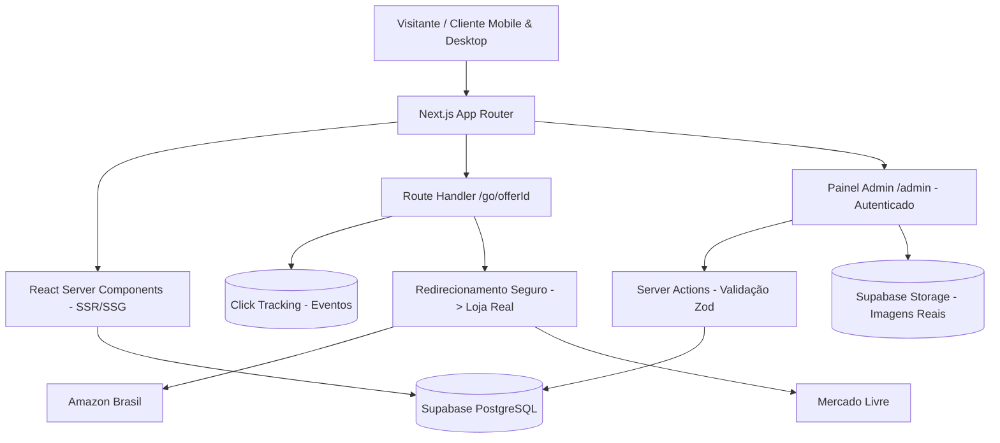
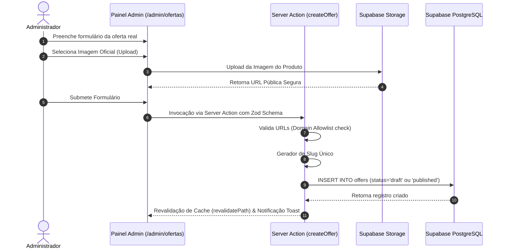
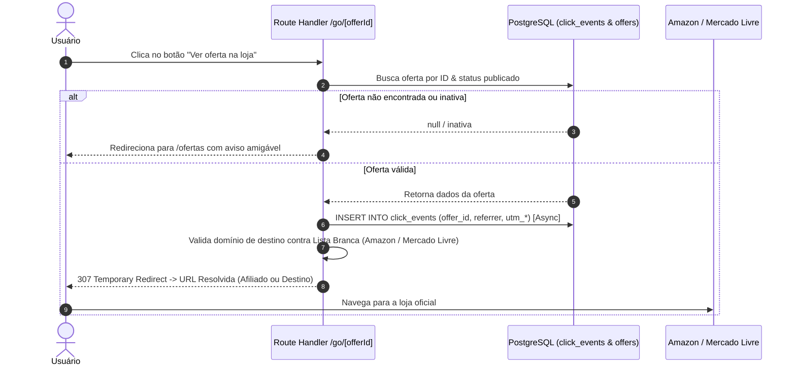

# PRECIO / PRECIM — Documentação de Arquitetura & Fundação (Checkpoint 1)

> **Status:** Checkpoint 1 — Proposto para Aprovação  
> **Data:** Setembro de 2026  
> **Projeto:** Portal Real de Ofertas e Afiliados (Greenfield)  

---

## 1. Arquitetura Proposta

O **PRECIM** (nome provisório centralizado em arquivo de configuração) é construído como uma aplicação web monolítica moderna e otimizada baseada em **Next.js (App Router)**, **TypeScript**, **Tailwind CSS** com tokens customizados e **Supabase (PostgreSQL + Auth + Storage)**.



### Princípios da Arquitetura:
- **Server-First:** Renderização de páginas de ofertas e categorias via Server Components (RSC) para máxima performance, SEO e baixíssimo consumo de JavaScript no cliente.
- **Zero Client Mock:** Todas as consultas consomem o banco PostgreSQL real. Se a tabela estiver vazia, os componentes renderizam estados vazios semestrais e elegantes (*Empty States*).
- **Isolamento de Negócio:** Camada de serviço desacoplada (`OfferService`, `MerchantService`, `TrackingService`) permitindo futura substituição ou adição de motores de integração sem refatorar views ou rotas.

---

## 2. Sitemap Estrutural

```
/                             (Home - Vitrine de ofertas reais + Seção editorial)
├── /ofertas                  (Catálogo geral de ofertas publicadas com filtros)
│   └── /[slug]               (Página de detalhe do produto real)
├── /categoria                (Redireciona para /ofertas)
│   └── /[slug]               (Ofertas filtradas por categoria)
├── /loja                     (Redireciona para /ofertas)
│   └── /[slug]               (Ofertas filtradas por loja/merchant)
├── /sobre                    (Histórico institucional e transparência da marca)
├── /como-funciona            (Explicação didática do fluxo do agregador)
├── /contato                  (Formulário de contato profissional com rate limit)
├── /divulgacao-de-afiliados  (Declaração de transparência sobre comissionamento)
├── /politica-de-privacidade  (Conformidade com a LGPD e gestão de dados)
├── /termos-de-uso            (Termos legais de navegação e isenção de responsabilidade)
├── /admin                    (Painel administrativo restrito)
│   ├── /login                (Autenticação do administrador)
│   ├── /ofertas              (Gestão de ofertas: criar, editar, expirar, destacar)
│   ├── /categorias           (Gestão de categorias)
│   └── /lojas                (Gestão de comerciantes)
└── /go/[offerId]             (Endpoint de tracking de clique e redirecionamento seguro)
```

---

## 3. Schema do Banco de Dados (PostgreSQL / Supabase)

O schema utiliza **tipos estritos**, chaves estrangeiras com integridade referencial, campos de timestamp com `TIMESTAMPTZ` e o tipo `NUMERIC(10, 2)` obrigatoriamente para valores monetários.

```sql
-- Habilitar extensões necessárias
CREATE EXTENSION IF NOT EXISTS "uuid-ossp";

-- ============================================================
-- 1. ENUMS E TIPOS
-- ============================================================
CREATE TYPE offer_status AS ENUM ('draft', 'published', 'expired', 'archived');

-- ============================================================
-- 2. CATEGORIAS (CATEGORIES)
-- ============================================================
CREATE TABLE categories (
    id UUID PRIMARY KEY DEFAULT uuid_generate_v4(),
    name VARCHAR(100) NOT NULL,
    slug VARCHAR(120) NOT NULL UNIQUE,
    description TEXT,
    active BOOLEAN NOT NULL DEFAULT true,
    created_at TIMESTAMPTZ NOT NULL DEFAULT NOW(),
    updated_at TIMESTAMPTZ NOT NULL DEFAULT NOW()
);

CREATE INDEX idx_categories_slug ON categories(slug);
CREATE INDEX idx_categories_active ON categories(active);

-- ============================================================
-- 3. LOJAS / COMERCIANTES (MERCHANTS)
-- ============================================================
CREATE TABLE merchants (
    id UUID PRIMARY KEY DEFAULT uuid_generate_v4(),
    name VARCHAR(100) NOT NULL,
    slug VARCHAR(120) NOT NULL UNIQUE,
    website_url VARCHAR(500) NOT NULL,
    logo_url VARCHAR(500),
    active BOOLEAN NOT NULL DEFAULT true,
    created_at TIMESTAMPTZ NOT NULL DEFAULT NOW(),
    updated_at TIMESTAMPTZ NOT NULL DEFAULT NOW()
);

CREATE INDEX idx_merchants_slug ON merchants(slug);
CREATE INDEX idx_merchants_active ON merchants(active);

-- ============================================================
-- 4. OFERTAS (OFFERS)
-- ============================================================
CREATE TABLE offers (
    id UUID PRIMARY KEY DEFAULT uuid_generate_v4(),
    title VARCHAR(255) NOT NULL,
    slug VARCHAR(280) NOT NULL UNIQUE,
    description TEXT,
    category_id UUID NOT NULL REFERENCES categories(id) ON DELETE RESTRICT,
    merchant_id UUID NOT NULL REFERENCES merchants(id) ON DELETE RESTRICT,
    current_price NUMERIC(10, 2) NOT NULL CHECK (current_price >= 0),
    previous_price NUMERIC(10, 2) CHECK (previous_price > current_price),
    coupon_code VARCHAR(50),
    image_url VARCHAR(1000) NOT NULL,
    destination_url VARCHAR(2000) NOT NULL,
    affiliate_url VARCHAR(2000),
    featured BOOLEAN NOT NULL DEFAULT false,
    free_shipping BOOLEAN DEFAULT false,
    status offer_status NOT NULL DEFAULT 'draft',
    starts_at TIMESTAMPTZ,
    expires_at TIMESTAMPTZ,
    published_at TIMESTAMPTZ,
    created_at TIMESTAMPTZ NOT NULL DEFAULT NOW(),
    updated_at TIMESTAMPTZ NOT NULL DEFAULT NOW()
);

CREATE INDEX idx_offers_slug ON offers(slug);
CREATE INDEX idx_offers_status ON offers(status);
CREATE INDEX idx_offers_category ON offers(category_id);
CREATE INDEX idx_offers_merchant ON offers(merchant_id);
CREATE INDEX idx_offers_featured ON offers(featured) WHERE status = 'published';
CREATE INDEX idx_offers_published_at ON offers(published_at DESC) WHERE status = 'published';

-- ============================================================
-- 5. EVENTOS DE CLIQUE (CLICK_EVENTS)
-- ============================================================
CREATE TABLE click_events (
    id UUID PRIMARY KEY DEFAULT uuid_generate_v4(),
    offer_id UUID NOT NULL REFERENCES offers(id) ON DELETE CASCADE,
    created_at TIMESTAMPTZ NOT NULL DEFAULT NOW(),
    referrer VARCHAR(1000),
    utm_source VARCHAR(100),
    utm_medium VARCHAR(100),
    utm_campaign VARCHAR(100)
);

CREATE INDEX idx_click_events_offer_id ON click_events(offer_id);
CREATE INDEX idx_click_events_created_at ON click_events(created_at DESC);

-- ============================================================
-- 6. POLÍTICAS DE SEGURANÇA (ROW LEVEL SECURITY - RLS)
-- ============================================================
ALTER TABLE categories ENABLE ROW LEVEL SECURITY;
ALTER TABLE merchants ENABLE ROW LEVEL SECURITY;
ALTER TABLE offers ENABLE ROW LEVEL SECURITY;
ALTER TABLE click_events ENABLE ROW LEVEL SECURITY;

-- Leitura Pública para Ofertas Publicadas, Categorias e Lojas Ativas
CREATE POLICY "Public Read Active Categories" ON categories FOR SELECT USING (active = true);
CREATE POLICY "Public Read Active Merchants" ON merchants FOR SELECT USING (active = true);
CREATE POLICY "Public Read Published Offers" ON offers FOR SELECT USING (
    status = 'published' AND 
    (starts_at IS NULL OR starts_at <= NOW()) AND 
    (expires_at IS NULL OR expires_at > NOW())
);

-- Inserção Pública Apenas para Eventos de Clique (via Service Role ou Função Segura)
CREATE POLICY "Public Insert Click Events" ON click_events FOR INSERT WITH CHECK (true);

-- Acesso Total apenas para Usuários Autenticados como Admin
CREATE POLICY "Admin Full Access Categories" ON categories FOR ALL TO authenticated USING (true);
CREATE POLICY "Admin Full Access Merchants" ON merchants FOR ALL TO authenticated USING (true);
CREATE POLICY "Admin Full Access Offers" ON offers FOR ALL TO authenticated USING (true);
CREATE POLICY "Admin Full Access Clicks" ON click_events FOR ALL TO authenticated USING (true);
```

---

## 4. Fluxo de Cadastro de Oferta Real



---

## 5. Fluxo `destination_url` → `affiliate_url`

Para garantir que a plataforma funcione **perfeitamente antes e depois da aprovação nos programas de afiliados**, a resolução da URL de destino é tratada de forma transparente e unificada:

```typescript
// Exemplo conceitual da função de resolução de URL
export function resolveOfferUrl(offer: {
  affiliate_url?: string | null;
  destination_url: string;
}): string {
  // Se existir um link de afiliado aprovado e válido, utiliza-o.
  // Caso contrário, faz fallback seguro para a URL direta do produto na loja parceira.
  const targetUrl = offer.affiliate_url?.trim() || offer.destination_url.trim();
  
  if (!isValidUrl(targetUrl)) {
    throw new Error('URL de destino da oferta é inválida.');
  }
  
  return targetUrl;
}
```

---

## 6. Fluxo `/go/[offerId]` (Tracking & Proteção Contra Open Redirect)



### Proteção Contra Open Redirect:
1. **Verificação de Domínio Permitido:** O sistema apenas redireciona para URLs pertencentes a domínios explicitamente cadastrados no banco (ex: `amazon.com.br`, `mercadolivre.com.br`, `mercadolibre.com`).
2. **Nenhuma URL Passada via Query Param:** O parâmetro é estritamente o `offerId` (UUID). O backend consulta o banco para obter a URL correspondente.

---

## 7. Estratégia de Autenticação (Admin)

- **Supabase Auth:** Utilização da autenticação nativa do Supabase com e-mail/senha com suporte a escopo restrito.
- **Sem Cadastro Público:** A rota `/admin` é protegida por Middleware do Next.js. O cadastro de novos usuários é desabilitado publicamente no painel do Supabase. Apenas usuários existentes na role de administração possuem permissão.
- **Sessões HTTP-Only Cookies:** Manipulação segura de tokens JWT via `@supabase/ssr` garantindo que o token não seja acessível via scripts no navegador.

---

## 8. Estratégia de Segurança

- **Row Level Security (RLS):** Garantia no nível do banco de dados que visitantes anônimos só conseguem ler ofertas com status `published`.
- **Validação com Zod:** Todos os inputs no backend (Server Actions e Route Handlers) passam obrigatoriamente por esquemas Zod estritos.
- **Headers de Segurança HTTP (`next.config.js`):**
  - `Content-Security-Policy` (CSP restrito a imagens e fontes permitidas)
  - `X-Frame-Options: DENY`
  - `X-Content-Type-Options: nosniff`
  - `Referrer-Policy: strict-origin-when-cross-origin`
- **Rate Limiting:** Aplicação de limite de requisições em formulários públicos (`/contato`) e no endpoint `/go/[offerId]` usando LRU Cache/Upstash para prevenir abusos.

---

## 9. Arquitetura Frontend

- **Next.js App Router & React Server Components:**
  - `app/(public)`: Layout público com Header, Footer e sistema de busca.
  - `app/admin`: Layout administrativo isolado com barra lateral e métricas reais.
- **Sistema de Design Proprietário:**
  - Tokenização em CSS nativo (Design System centralizado em `styles/tokens.css`).
  - Isenção de visual genérico "SaaS/VibeCode": Sem hero centralizado gigante, sem blobs coloridos, sem botões em forma de pílula genéricos.
- **Tratamento de Preço & Marker PRECIM:**
  - Componente de exibição de preço com hierarquia clara (Centavos menores, moeda em destaque, tag de desconto quando existente).

---

## 10. Arquitetura Backend

```
lib/
├── config/
│   └── site.config.ts        # Identidade nominal (PRECIM), taglines, dados da empresa
├── db/
│   └── supabase-server.ts    # Cliente Supabase Server (cookies)
│   └── supabase-client.ts    # Cliente Supabase Browser
├── services/
│   ├── offer.service.ts      # Regras de negócio de ofertas
│   ├── merchant.service.ts   # Regras de lojas
│   └── tracking.service.ts   # Registro e agregados de cliques
└── validators/
    └── offer.schema.ts       # Esquemas de validação Zod
```

---

## 11. Estratégia de Imagens Reais

- **Sem Imagens Fictícias:** Não haverá imagens de demonstração (*Unsplash*, *Lorem Picsum*, *Placeholder.com*).
- **Armazenamento Local/Bucket Supabase Storage:** As imagens das ofertas serão enviadas no cadastro do produto para o bucket `offers` do Supabase Storage.
- **Otimização `next/image`:** Todas as imagens renderizadas usarão o componente `<Image />` do Next.js com suporte a formato WebP/AVIF, carregamento sob demanda (*lazy*) e dimensões explícitas para evitar layout shift (CLS).

---

## 12. Estratégia SEO Técnica & Dados Estruturados

- **Dynamic Metadata API:** Cada página de oferta gera automaticamente meta títulos, meta descrições e tags OpenGraph dinâmicas baseadas na oferta real.
- **Canonical URLs:** Garantia de URLs canônicas limpas e padronizadas.
- **JSON-LD (Structured Data):**
  - `Organization` na página inicial e institucional.
  - `Product` e `Offer` na página `/ofertas/[slug]` preenchendo **apenas** dados reais presentes (sem inventar ratings ou reviews fictícios).

---

## 13. Direção Inicial de Arte (Identidade "PRECIM")

- **Conceito:** "Nascido em Minas, pensado para o Brasil."
- **Paleta de Cores:**
  - *Verde Relevo (Principal):* `#1B4D3E` (Tom profundo de floresta/montanha, transmite confiança e oportunidade)
  - *Ocre Ouro (Destaque/Preço):* `#D97706` (Inspirado nas riquezas minerais e sol no horizonte)
  - *Cinza Pedra (Neutros):* `#1F2937` / `#F9FAFB`
- **Marcador Proprietário (Marker PRECIM):**
  - Ícone geométrico sutil que remete à sobreposição de montanhas com um indicador descendente de desconto/preço baixo.
- **Tipografia:**
  - *Título/Headings:* **Plus Jakarta Sans** ou **Outfit** (Moderna, geométrica, com alta legibilidade).
  - *Preço/Destaques Monetários:* **Tabular Sans / JetBrains Mono** (Alinhamento perfeito de dígitos).

---

## 14. Riscos Técnicos & Mitigações

1. **Risco:** Links de ofertas expirando no marketplace de origem.
   - *Mitigação:* Campo `expires_at` no banco + botão de "Expiração Manual" rápida no Admin + cron job futuro para arquivar ofertas vencidas.
2. **Risco:** Injeção de URLs maliciosas no campo de redirecionamento.
   - *Mitigação:* Validação estrita de domínio no Server Action e no Handler `/go/[offerId]`.

---

## 15. Riscos Comerciais & Mitigações

1. **Risco:** Rejeição do site em programas de afiliados por falta de tráfego inicial ou conteúdo.
   - *Mitigação:* O site funcionará imediatamente com `destination_url` direta dos produtos reais, garantindo valor ao usuário antes mesmo do comissionamento.
2. **Risco:** Perda de credibilidade por preços desatualizados.
   - *Mitigação:* Aviso claro e transparente na página da oferta orientando a conferir o valor exato no site parceiro.

---

## 16. Pontos Configuráveis (`site.config.ts`)

```typescript
export const SITE_CONFIG = {
  name: "PRECIM",
  legalName: "PRECIM Ofertas Ltda",
  tagline: "Uai, achamos um precim bão.",
  subtagline: "Ofertas selecionadas para você encontrar boas oportunidades de compra sem perder tempo procurando.",
  region: "Minas Gerais, Brasil",
  social: {
    instagram: process.env.NEXT_PUBLIC_SOCIAL_INSTAGRAM_URL || null,
    whatsapp: process.env.NEXT_PUBLIC_SOCIAL_WHATSAPP_URL || null,
  },
  merchantsAllowed: ["Amazon", "Mercado Livre"],
};
```

---

## 17. Estrutura de Diretórios Proposta

```
precim-app/
├── app/
│   ├── (public)/
│   │   ├── page.tsx
│   │   ├── ofertas/
│   │   │   ├── page.tsx
│   │   │   └── [slug]/page.tsx
│   │   ├── categoria/[slug]/page.tsx
│   │   ├── loja/[slug]/page.tsx
│   │   ├── sobre/page.tsx
│   │   ├── como-funciona/page.tsx
│   │   ├── contato/page.tsx
│   │   ├── divulgacao-de-afiliados/page.tsx
│   │   ├── politica-de-privacidade/page.tsx
│   │   └── termos-de-uso/page.tsx
│   ├── admin/
│   │   ├── layout.tsx
│   │   ├── page.tsx
│   │   ├── login/page.tsx
│   │   └── ofertas/
│   │       ├── page.tsx
│   │       └── nova/page.tsx
│   ├── go/
│   │   └── [offerId]/route.ts
│   ├── layout.tsx
│   ├── global.css
│   ├── sitemap.ts
│   └── robots.ts
├── components/
│   ├── ui/                    # Componentes base customizados (sem visual genérico)
│   ├── offers/                # OfferCardCompact, OfferCardStandard, OfferCardFeatured
│   ├── layout/                # Header, Footer, MobileNav
│   └── common/                # EmptyState, PriceTag, MarkerPrecim
├── lib/
│   ├── config/
│   ├── db/
│   ├── services/
│   └── utils/
├── public/
│   └── brand/                 # Logotipos SVG, favicon, marker
├── styles/
│   └── tokens.css             # Tokens do Design System
├── docs/
│   ├── ARCHITECTURE.md
│   └── ROADMAP.md
├── .env.example
├── next.config.js
├── tailwind.config.js
└── package.json
```

---

## 18. Plano de Implementação em Fases (Checkpoints)

- **Checkpoint 1 (Atual):** Fundação, Arquitetura, Schema SQL, Fluxos e Validação Teórica. *(Aguardando Aprovação)*
- **Checkpoint 2:** Direção de Arte, Tokens CSS, Componente Marker PRECIM, Variantes de OfferCards e Wireframes.
- **Checkpoint 3:** Frontend — Aplicação do Design System, Páginas Públicas (Home, Ofertas, Detalhe, Filtros, Busca).
- **Checkpoint 4:** Backend & Banco — Conexão Supabase, Auth Admin, Server Actions CRUD e Endpoint `/go/[offerId]`.
- **Checkpoint 5:** Conteúdo Institucional & SEO — Páginas Legais, Sobre, Como Funciona, Sitemap XML, OpenGraph e Schema.org.
- **Checkpoint 6:** QA, Testes de Integração, Responsividade, Performance, Acessibilidade e Relatório Final.

---

### Solicitação de Validação
O **Checkpoint 1** foi concluído com base nos requisitos especificados. Aguardo sua aprovação para prosseguir para o **Checkpoint 2 (Direção de Arte e Componentes Visuais)**.
